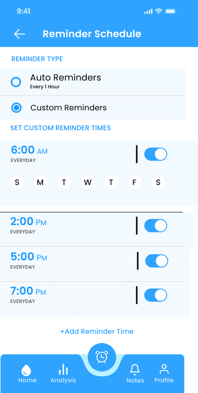
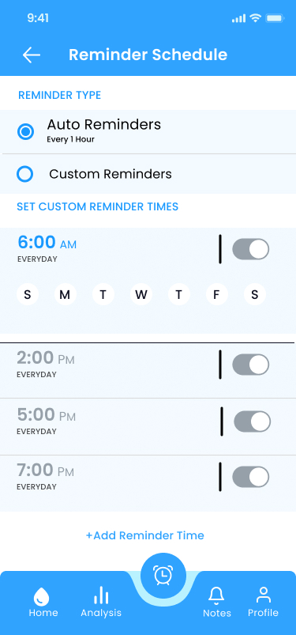
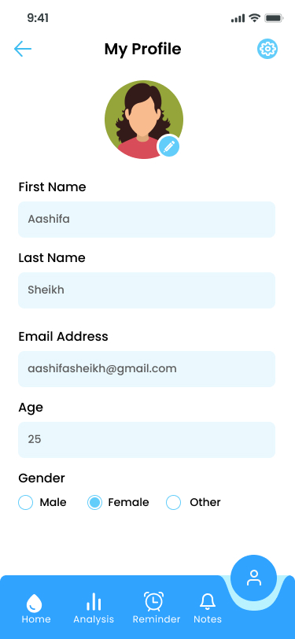

# Hydration - Tracker

## About Project

Hydration adalah aplikasi yang dibuat untuk membantu meningkatkan kesadaran masyarakat dalam memenuhi kebutuhan minum sehari-hari. Saat ini, banyak orang lebih memilih minuman berasa dibandingkan air putih, sehingga kebutuhan cairan harian sering kali kurang diperhatikan. Melalui aplikasi ini, pengguna dapat mencatat konsumsi air, melihat statistik hidrasi, dan mendapatkan pengingat untuk minum secara rutin.

## Figma Design

[View Figma Design](https://www.figma.com/design/xMVeJIGWobcV2EQeJ0fx6m/Untitled?node-id=0-1&t=HPkQ18sO7AK5gE05-1)

## UI/UX Design

### Splash Screen

### Onboarding 1

### Onboarding 2

### Onboarding 3

### Log In

### Sign In

### Forgot Password

### Home Page

### Light Daily Stats

### Light Monthly Stats

### Light Weekly Stats

### Light Stats Desktop

### Reminder

### Reminder 1

## Notes

### Profile

### Log Out

